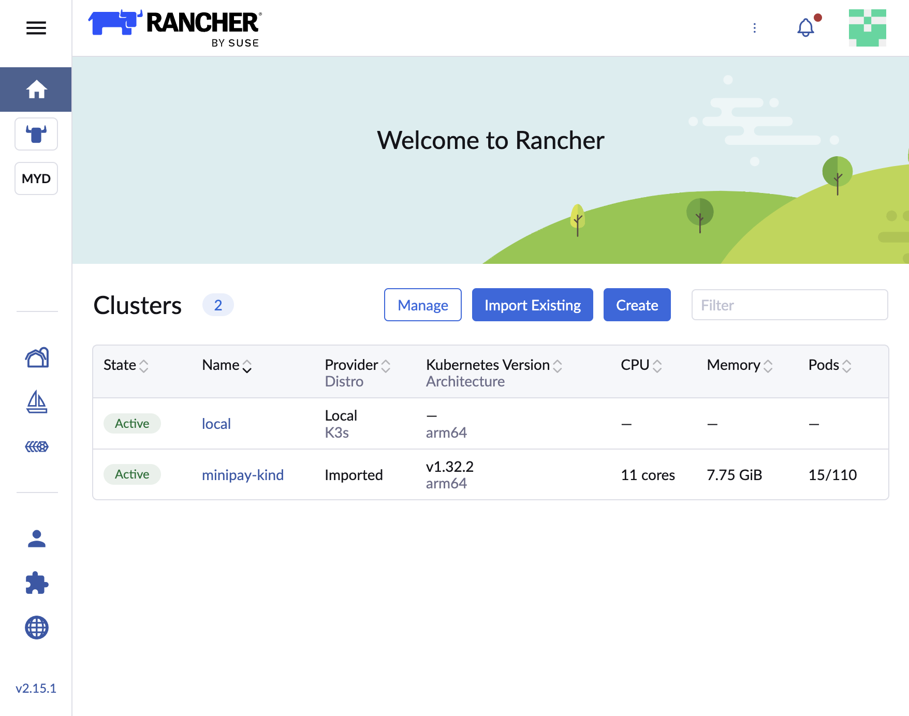
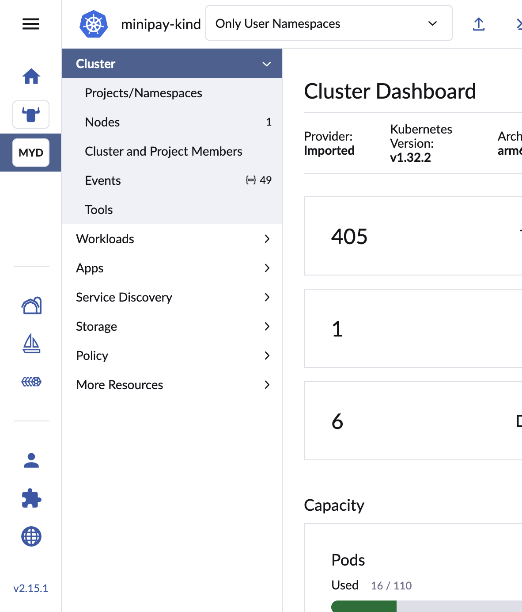
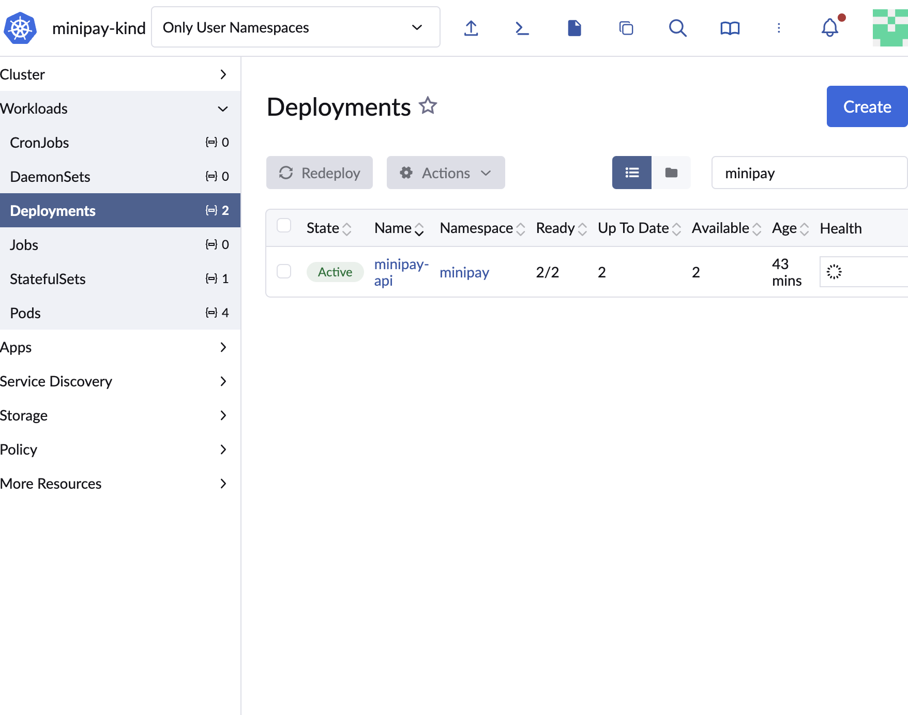
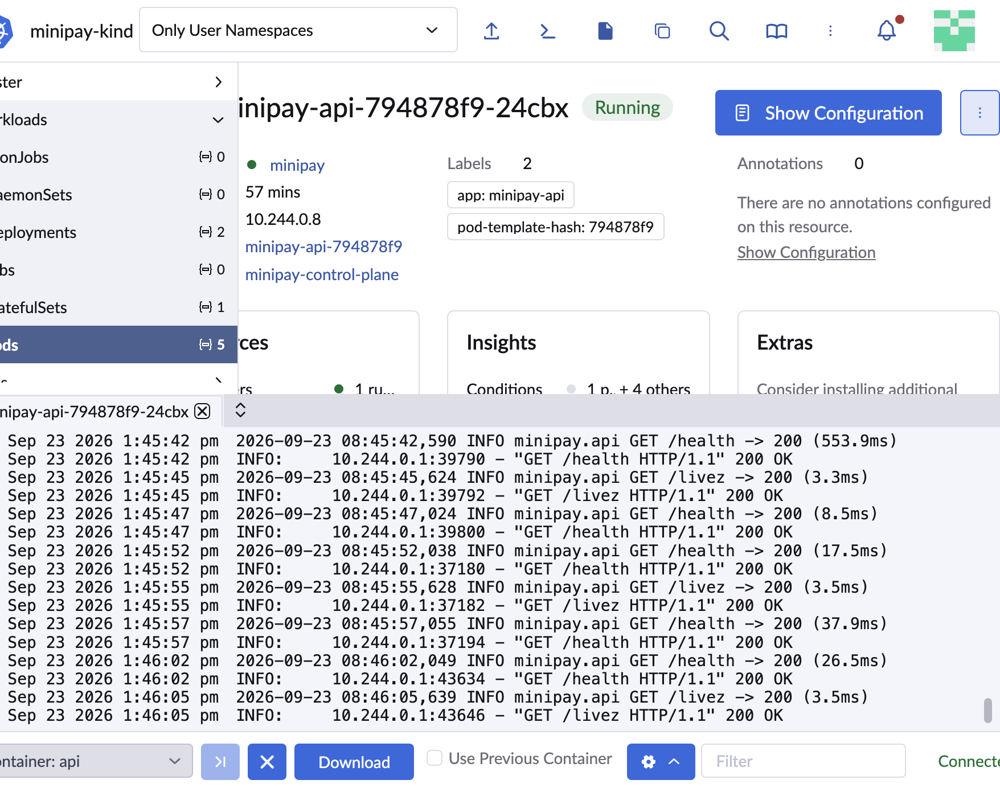
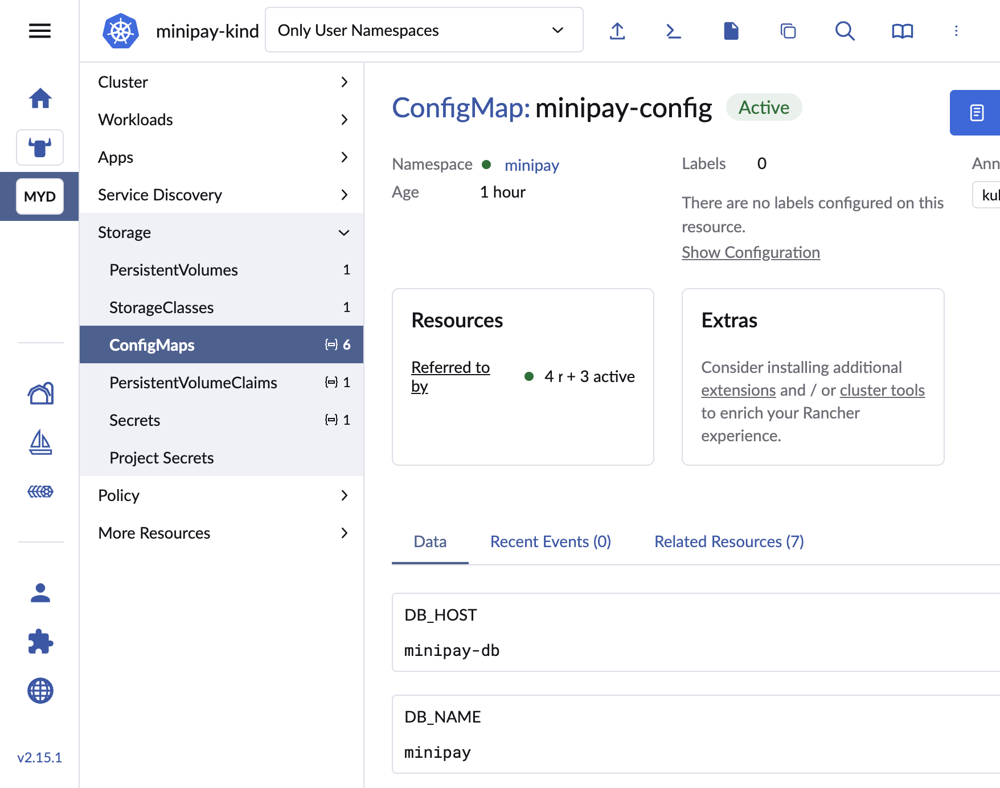
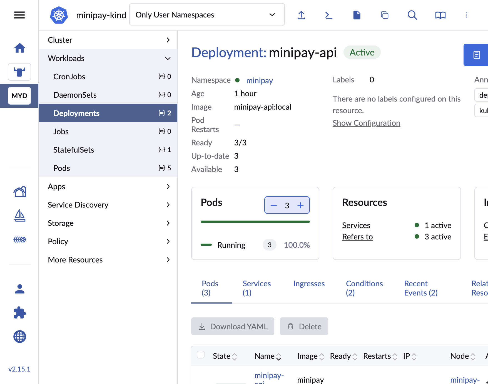
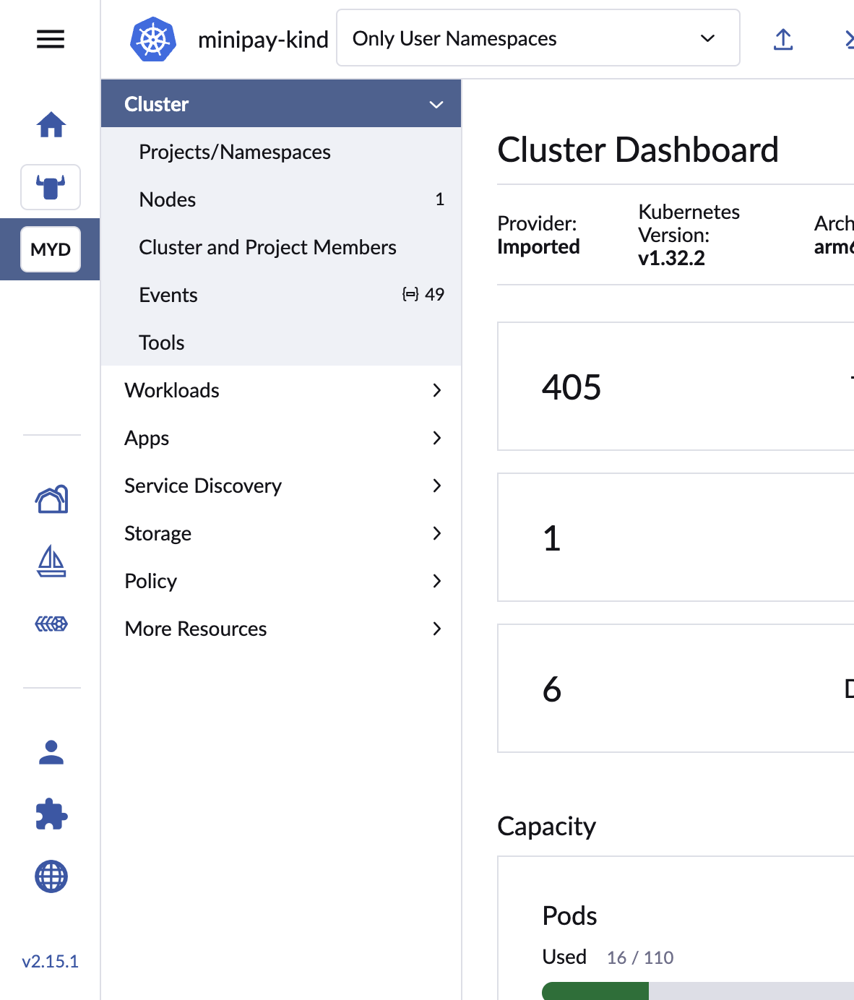

# Rancher evidence

Rancher was run locally as a Docker container and used to manage the
`kind` MiniPay cluster (`SETUP.md` §7–8). Screenshots below are redacted
of secrets/bootstrap passwords.

## How it was set up
```bash
docker run -d --name rancher --privileged \
  -p 8443:443 -p 8080:80 \
  rancher/rancher:latest

# Bootstrap password from:
docker logs rancher 2>&1 | grep "Bootstrap Password:"

# UI: https://localhost:8443 — Import Existing cluster, then apply the
# registration manifest Rancher prints against the kind cluster.
```

## Checklist evidence

### 1. Cluster / workload visibility
- Home clusters: 
- Workloads overview: 
- Deployments: 
- StatefulSets: 

### 2. Pod status and logs
- Pods list: 
- Pod logs: 

### 3. Configuration / environment inspection
- Env vars on an API pod (Secret values masked by Rancher UI):
  

### 4. Scaling / rollout
- Replica scale from Rancher UI:
  

CLI equivalents used for cross-check:
```bash
kubectl scale deployment minipay-api -n minipay --replicas=3
kubectl rollout restart deployment minipay-api -n minipay
kubectl rollout status deployment minipay-api -n minipay
```

### 5. Basic resource / health visibility
- 
- 

## Related
- Live `kubectl` evidence for the same cluster: `evidence/kubernetes.md`
- Defect analysis of the broken starter manifest:
  `investigation/kubernetes-findings.md`
